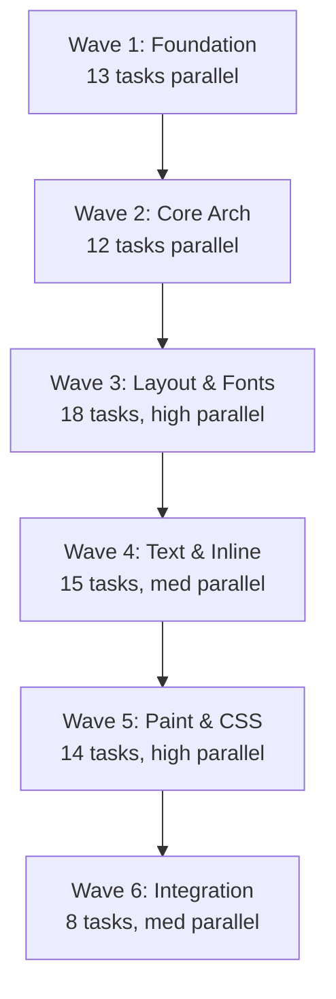

# FastRender V2 Task Dependency Graph

This document defines the complete task graph for rebuilding FastRender V2. Each task is an independent unit of work that can be executed by an isolated agent.

## Task Organization

Tasks are organized in **waves** to maximize parallelism. All tasks within a wave can execute in parallel. Each task produces outputs (code + notes) that subsequent waves consume.

```
Wave 1 (13 tasks) → Wave 2 (12 tasks) → Wave 3 (18 tasks) → Wave 4 (15 tasks) → Wave 5 (14 tasks) → Wave 6 (8 tasks)
```

**Total: 80 tasks** organized for maximum parallel execution.

## Task Metadata Format

Each task file has frontmatter:

```yaml
---
task_id: "W1.T01"
title: "Task Title"
wave: 1
estimated_hours: 4-8
depends_on: []
inputs: []
outputs:
  - "path/to/code.rs"
  - "docs/tasks/notes/W1.T01-notes.md"
skills_required: ["Rust", "CSS"]
context_files: ["docs/*/relevant.md"]
---
```

## Output Artifacts

Each task produces:

1. **Code/Tests**: Implementation files
2. **Notes File**: `docs/tasks/notes/{task_id}-notes.md` containing:
   - **Decisions Made**: Architectural choices and rationale
   - **API Contracts**: Type signatures, trait definitions, public APIs
   - **Discoveries**: Gotchas, pitfalls, non-obvious behaviors
   - **Spec Interpretations**: How ambiguous specs were resolved
   - **Performance Notes**: Optimization opportunities
   - **Recommendations**: Guidance for downstream tasks
   - **Open Questions**: Unresolved issues for later tasks

## Wave 1: Foundation (13 tasks, 0 dependencies)

All tasks in Wave 1 can run in **complete parallel**.

### Research Tasks (5 tasks)

| Task ID | Title | Hours | Outputs |
|---------|-------|-------|---------|
| **W1.R01** | CSS 2.1 Visual Formatting Model Research | 8-12 | Research notes on chapters 9-10 |
| **W1.R02** | CSS Table Layout Specification Research | 6-8 | Research notes on table algorithm |
| **W1.R03** | Unicode Bidi & Line Breaking Research | 6-8 | Research notes on UAX#9, UAX#14 |
| **W1.R04** | Browser Layout Code Study (Servo) | 8-12 | Research notes on Servo architecture |
| **W1.R05** | CSS Stacking Context Research | 4-6 | Research notes on Appendix E |

### Core Types (8 tasks)

| Task ID | Title | Hours | Outputs |
|---------|-------|-------|---------|
| **W1.T01** | Implement Geometry Types (Point, Size, Rect) | 4-6 | `src/geometry.rs` + tests |
| **W1.T02** | Implement Error Types | 3-4 | `src/error.rs` + tests |
| **W1.T03** | Implement Length and Unit Types | 4-6 | `src/style/values.rs` + tests |
| **W1.T04** | Implement Color Types | 4-6 | `src/style/color.rs` + tests |
| **W1.T05** | Implement Display Enum | 3-4 | `src/style/display.rs` + tests |
| **W1.T06** | Implement Position Enum | 2-3 | `src/style/position.rs` + tests |
| **W1.T07** | Create Project Structure | 2-3 | Module files, Cargo.toml updates |
| **W1.T08** | Setup Development Tools | 3-4 | CI config, clippy, rustfmt |

**Wave 1 Total: 13 tasks, ~60-80 hours of parallel work**

## Wave 2: Core Architecture (12 tasks)

Depends on: Wave 1 completion

All tasks in Wave 2 can run in **parallel** (they consume Wave 1 outputs).

### Type System (6 tasks)

| Task ID | Title | Hours | Depends On | Outputs |
|---------|-------|-------|------------|---------|
| **W2.T01** | Implement BoxNode Type | 4-6 | W1.T01, W1.T03 | `src/tree/box_tree.rs` |
| **W2.T02** | Implement BoxType Enum | 3-4 | W1.T05 | `src/tree/box_type.rs` |
| **W2.T03** | Implement FragmentNode Type | 4-6 | W1.T01 | `src/tree/fragment_tree.rs` |
| **W2.T04** | Implement LayoutConstraints | 3-4 | W1.T01, W1.T03 | `src/layout/constraints.rs` |
| **W2.T05** | Implement ComputedStyle Struct | 6-8 | W1.T03, W1.T04, W1.T05 | `src/style/computed.rs` |
| **W2.T06** | Implement DebugInfo Types | 2-3 | W2.T01 | `src/tree/debug.rs` |

### Formatting Context Abstraction (6 tasks)

| Task ID | Title | Hours | Depends On | Outputs |
|---------|-------|-------|------------|---------|
| **W2.T07** | Define FormattingContext Trait | 4-6 | W2.T01, W2.T03, W2.T04 | `src/layout/contexts/trait.rs` |
| **W2.T08** | Implement FormattingContextType Enum | 2-3 | W1.T05 | `src/layout/contexts/types.rs` |
| **W2.T09** | Implement FC Factory Structure | 3-4 | W2.T07, W2.T08 | `src/layout/contexts/factory.rs` |
| **W2.T10** | Implement LayoutEngine Struct | 4-6 | W2.T07, W2.T09 | `src/layout/engine.rs` |
| **W2.T11** | Implement Box Generator Structure | 6-8 | W2.T01, W2.T02 | `src/tree/box_generation.rs` (stub) |
| **W2.T12** | Create Debug Visualization Tools | 4-6 | W2.T01, W2.T03 | `src/debug/tree_printer.rs` |

**Wave 2 Total: 12 tasks, ~45-65 hours of parallel work**

## Wave 3: Layout Algorithms & Font System (18 tasks)

Depends on: Wave 2 completion

High parallelism - most layout algorithms are independent!

### Box Generation (3 tasks)

| Task ID | Title | Hours | Depends On | Outputs |
|---------|-------|-------|------------|---------|
| **W3.T01** | Implement Box Generation Algorithm | 8-12 | W2.T11, W1.R01 | `src/tree/box_generation.rs` (full) |
| **W3.T02** | Implement Anonymous Box Creation | 6-8 | W3.T01 | Box generation updates |
| **W3.T03** | Implement Table Structure Fixup | 6-8 | W3.T01, W1.R02 | Box generation updates |

### Layout Algorithms (10 tasks - HIGH PARALLELISM)

| Task ID | Title | Hours | Depends On | Outputs |
|---------|-------|-------|------------|---------|
| **W3.T04** | Implement Block Layout Algorithm | 10-14 | W2.T07, W1.R01 | `src/layout/contexts/block.rs` |
| **W3.T05** | Implement Margin Collapsing | 6-8 | W3.T04 | `src/layout/contexts/block/margin.rs` |
| **W3.T06** | Implement Table Layout Algorithm | 12-16 | W2.T07, W1.R02 | `src/layout/contexts/table.rs` |
| **W3.T07** | Implement Table Column Algorithm | 8-10 | W3.T06 | `src/layout/contexts/table/columns.rs` |
| **W3.T08** | Implement Flex Layout Wrapper | 6-8 | W2.T07 | `src/layout/contexts/flex.rs` |
| **W3.T09** | Implement Grid Layout Wrapper | 6-8 | W2.T07 | `src/layout/contexts/grid.rs` |
| **W3.T10** | Implement Float Context | 8-12 | W2.T07, W1.R01 | `src/layout/contexts/float.rs` |
| **W3.T11** | Implement Float Placement Algorithm | 8-10 | W3.T10 | Float context updates |
| **W3.T12** | Implement Positioned Layout Base | 6-8 | W2.T07 | `src/layout/contexts/positioned.rs` |
| **W3.T13** | Implement Absolute Positioning | 8-10 | W3.T12 | Positioned layout updates |

**Note**: W3.T04-W3.T13 can run in parallel! They all implement FormattingContext independently.

### Font System (5 tasks - SEQUENTIAL)

| Task ID | Title | Hours | Depends On | Outputs |
|---------|-------|-------|------------|---------|
| **W3.T14** | Implement FontDatabase | 8-10 | W1.T02 | `src/text/font_db.rs` |
| **W3.T15** | Implement Font Loading & Caching | 6-8 | W3.T14 | `src/text/font_loader.rs` |
| **W3.T16** | Implement Font Metrics Extraction | 6-8 | W3.T15 | `src/text/font_metrics.rs` |
| **W3.T17** | Implement Font Fallback Chain | 4-6 | W3.T15 | Font loader updates |
| **W3.T18** | Create FontContext API | 4-6 | W3.T15, W3.T16 | `src/text/mod.rs` |

**Wave 3 Total: 18 tasks, ~120-160 hours (but highly parallel, ~15-20 hours wall time)**

## Wave 4: Text Shaping & Inline Layout (15 tasks)

Depends on: Wave 3 completion (needs font system for inline layout)

### Text Shaping Pipeline (7 tasks - MOSTLY PARALLEL)

| Task ID | Title | Hours | Depends On | Outputs |
|---------|-------|-------|------------|---------|
| **W4.T01** | Implement Bidi Analyzer | 8-10 | W1.R03 | `src/text/bidi.rs` |
| **W4.T02** | Implement Script Itemizer | 6-8 | W1.R03 | `src/text/script.rs` |
| **W4.T03** | Implement Text Shaper (rustybuzz) | 10-12 | W3.T18 | `src/text/shaper.rs` |
| **W4.T04** | Implement Emoji Detection | 4-6 | - | `src/text/emoji.rs` |
| **W4.T05** | Implement Shaping Pipeline | 6-8 | W4.T01, W4.T02, W4.T03 | `src/text/pipeline.rs` |
| **W4.T06** | Implement Glyph Clustering | 4-6 | W4.T05 | Pipeline updates |
| **W4.T07** | Integrate Shaping with Font System | 4-6 | W4.T05, W3.T18 | API integration |

### Line Breaking (4 tasks - SEQUENTIAL)

| Task ID | Title | Hours | Depends On | Outputs |
|---------|-------|-------|------------|---------|
| **W4.T08** | Implement Break Opportunity Finder | 6-8 | W1.R03 | `src/text/line_break.rs` |
| **W4.T09** | Implement Greedy Line Breaker | 6-8 | W4.T08 | Line break updates |
| **W4.T10** | Implement Hyphenation | 8-10 | W4.T09 | `src/text/hyphenation.rs` |
| **W4.T11** | Implement Text Justification | 6-8 | W4.T09 | `src/text/justify.rs` |

### Inline Layout (4 tasks)

| Task ID | Title | Hours | Depends On | Outputs |
|---------|-------|-------|------------|---------|
| **W4.T12** | Implement Inline Formatting Context | 12-16 | W2.T07, W4.T05, W4.T09 | `src/layout/contexts/inline.rs` |
| **W4.T13** | Implement Baseline Alignment | 6-8 | W4.T12, W3.T16 | Inline FC updates |
| **W4.T14** | Implement Text Run Generation | 6-8 | W4.T12, W4.T05 | Inline FC updates |
| **W4.T15** | Integrate Inline with Float | 6-8 | W4.T12, W3.T10 | Inline FC updates |

**Wave 4 Total: 15 tasks, ~100-130 hours (parallel sections reduce wall time)**

## Wave 5: Paint System & CSS Features (14 tasks)

Depends on: Wave 4 completion

### Display List & Stacking (5 tasks)

| Task ID | Title | Hours | Depends On | Outputs |
|---------|-------|-------|------------|---------|
| **W5.T01** | Implement Display List Types | 6-8 | W2.T03 | `src/paint/display_list.rs` |
| **W5.T02** | Implement Display List Builder | 8-10 | W5.T01 | Display list updates |
| **W5.T03** | Implement Stacking Context Tree | 8-10 | W1.R05, W2.T03 | `src/paint/stacking.rs` |
| **W5.T04** | Implement Paint Order Sorter | 8-10 | W5.T03, W1.R05 | Stacking updates |
| **W5.T05** | Implement Display List Optimization | 4-6 | W5.T02 | Display list updates |

### Rasterization (3 tasks)

| Task ID | Title | Hours | Depends On | Outputs |
|---------|-------|-------|------------|---------|
| **W5.T06** | Implement Canvas Wrapper (tiny-skia) | 6-8 | W5.T01 | `src/paint/canvas.rs` |
| **W5.T07** | Implement Path Rendering | 8-10 | W5.T06 | `src/paint/rasterize.rs` |
| **W5.T08** | Implement Text Rasterization | 8-10 | W5.T07, W4.T05 | Rasterize updates |

### CSS Features (6 tasks - HIGH PARALLELISM)

| Task ID | Title | Hours | Depends On | Outputs |
|---------|-------|-------|------------|---------|
| **W5.T09** | Implement Pseudo-Element Box Generation | 8-10 | W3.T01 | Box generation updates |
| **W5.T10** | Implement Content Generation | 6-8 | W5.T09 | `src/style/content.rs` |
| **W5.T11** | Implement Counter System | 8-10 | W5.T10 | `src/style/counters.rs` |
| **W5.T12** | Implement Media Query Parser | 6-8 | W2.T05 | `src/style/media.rs` |
| **W5.T13** | Implement CSS Variables Storage | 6-8 | W2.T05 | `src/style/variables.rs` |
| **W5.T14** | Implement var() Resolution | 6-8 | W5.T13 | Variables updates |

**Wave 5 Total: 14 tasks, ~95-120 hours (parallel sections reduce wall time)**

## Wave 6: Integration & Testing (8 tasks)

Depends on: Wave 5 completion

### Integration (3 tasks - SEQUENTIAL)

| Task ID | Title | Hours | Depends On | Outputs |
|---------|-------|-------|------------|---------|
| **W6.T01** | Integrate All FCs into Factory | 6-8 | W3.T04-W4.T12 | Factory updates |
| **W6.T02** | Wire Complete Rendering Pipeline | 8-12 | W6.T01, W5.T08 | `src/renderer.rs` |
| **W6.T03** | Implement Public API | 6-8 | W6.T02 | `src/lib.rs`, API docs |

### Testing Infrastructure (5 tasks - HIGH PARALLELISM)

| Task ID | Title | Hours | Depends On | Outputs |
|---------|-------|-------|------------|---------|
| **W6.T04** | Implement WPT Test Runner | 10-14 | W6.T02 | `tests/wpt/runner.rs` |
| **W6.T05** | Implement Reference Test Harness | 8-10 | W6.T02 | `tests/ref/harness.rs` |
| **W6.T06** | Implement Benchmark Suite | 8-10 | W6.T02 | `benches/comprehensive.rs` |
| **W6.T07** | Setup CI/CD Pipeline | 6-8 | W6.T04, W6.T05 | `.github/workflows/` |
| **W6.T08** | Create Test Fixtures & Golden Images | 8-12 | W6.T05 | `tests/fixtures/` |

**Wave 6 Total: 8 tasks, ~60-80 hours**

## Dependency Visualization



## Critical Path Analysis

**Longest sequential chain** (minimum wall-clock time):

1. W1.T01 (Geometry) → W2.T01 (BoxNode) → W2.T07 (FC Trait) → W3.T04 (Block Layout) → W4.T12 (Inline Layout) → W5.T02 (Display List) → W5.T08 (Rasterize) → W6.T02 (Integration)

**Critical path: ~80-100 hours minimum wall-clock time**

With full parallelization across ~10 agents, the project could complete in as little as **2-3 weeks** (vs. 6-12 months serial).

## Task File Location

All task files are in: `docs/tasks/`

```
docs/tasks/
├── TASK_GRAPH.md (this file)
├── TASK_TEMPLATE.md (template for creating tasks)
├── wave-1/
│   ├── W1.R01-css-visual-formatting.md
│   ├── notes/W1.T01-notes.md
│   └── ...
├── wave-2/
│   ├── W2.T01-boxnode-type.md
│   └── ...
├── wave-3/
│   ├── W3.T04-block-layout.md
│   └── ...
└── outputs/
    └── notes/
        ├── W1.R01-notes.md
        └── ...
```

## Execution Strategy

1. **Start Wave 1**: Launch all 13 tasks in parallel
2. **Collect Wave 1 outputs**: Gather all code + notes files
3. **Start Wave 2**: Launch all 12 tasks in parallel (they read Wave 1 notes)
4. **Repeat** for subsequent waves

Each agent:
- Reads its task file (completely self-contained)
- Reads input notes from dependencies
- Implements the task
- Writes code + tests
- Writes comprehensive notes for downstream tasks

## Notes File Schema

Every task outputs: `docs/tasks/notes/{task_id}-notes.md`

```markdown
# Task {task_id} Output Notes

## Implementation Summary
[What was built, high-level overview]

## API Contracts
[Public types, traits, functions with signatures]

## Decisions Made
[Architectural choices and why]

## Spec Interpretations
[How ambiguous CSS specs were resolved]

## Discoveries & Gotchas
[Non-obvious behaviors, pitfalls]

## Performance Notes
[Optimization opportunities, benchmarks]

## Recommendations for Downstream Tasks
[Specific guidance for tasks that depend on this]

## Open Questions
[Unresolved issues for future work]

## Test Coverage
[What's tested, what gaps remain]
```

## Getting Started

1. Read `TASK_TEMPLATE.md` to understand task file structure
2. Review task files in `wave-1/` to see examples
3. Start executing Wave 1 tasks in parallel
4. Collect outputs in `outputs/` directory
5. Proceed to Wave 2 when Wave 1 completes

## Success Metrics

- **All 80 tasks complete** with passing tests
- **All notes files created** with comprehensive documentation
- **WPT pass rate > 80%** for implemented features
- **Reference tests pass > 95%**
- **Performance within 2x of browser baseline**

---

**Last Updated:** 2025-01-20
**Total Tasks:** 80
**Estimated Serial Time:** 600-800 hours (6-12 months)
**Estimated Parallel Time:** 80-100 hours (2-3 weeks with ~10 agents)
